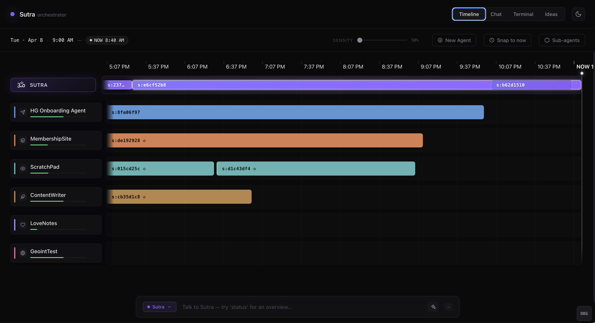

# sutra-os

A local-first AI orchestrator for managing multiple Claude Code agents. One entry point, ambient awareness, automatic context management.



## What it does

You talk to **Sutra** — one orchestrator. Sutra dispatches work to sandboxed Claude Code agents, monitors their progress in real time on a DAW-style timeline, and manages their context windows automatically. Each Claude session shows up as a block on the timeline; when context gets too full, Sutra spoofs the session (compresses history into a fresh start) and the new block opens with a visible seam linking it to its parent.

Run as many specialized agents as you like — a **CPA**, a **Legal** researcher, a **Designer**, a **Marketing** writer, a **VirtualAdmin** — each in their own sandboxed working directory. They report back through hooks (zero-cost observability), and you see everything from a single browser tab.

```
You ──> Sutra (orchestrator) ──> Agent A (CPA)
                              ──> Agent B (Legal)
                              ──> Agent C (Designer)
                              ──> Agent D (Marketing)
```

## Quick start

```bash
git clone https://github.com/ckelimarks/sutra-os.git
cd sutra-os

# Configure
cp .env.example .env
# Edit .env to set SUTRA_PROJECT_ROOT to a directory where you want agents
# to work. Example: ~/Code/my-project

# Install dependencies (use `python3 -m pip` rather than bare `pip` —
# stock macOS doesn't put pip on the PATH)
python3 -m pip install -r requirements.txt

# Run (start.sh sources .env, picks a Python ≥ 3.10 interpreter, kicks off
# both the HTTP and WebSocket servers)
./start.sh
```

If `./start.sh` reports "Permission denied", run `chmod +x start.sh` once. Or invoke as `bash start.sh`.

Open http://localhost:8900

You'll need:
- **Python 3.10 or newer.** Stock macOS ships with 3.9, which is not enough — Continuum's `spoof_tool.py` uses PEP 604 union types (`str | Path`) that only parse on 3.10+. Install with `brew install python@3.12` or similar.
- **Claude Code CLI** installed and authenticated (`claude auth login`).
- **(Optional) [Continuum](https://github.com/symbolic01/continuum)** for session compression on auto-reset. If absent, resets fall back to a clean fresh start.

### Creating your first agent

After `./start.sh` is running, the canonical orchestrator agent is named **Sutra** and gets a default system prompt that teaches it how to dispatch via curl. Create it once:

```bash
mkdir -p $SUTRA_PROJECT_ROOT
curl -s -X POST http://localhost:8900/api/agents \
  -H "Content-Type: application/json" \
  -d "{
    \"name\": \"Sutra\",
    \"cwd\": \"$SUTRA_PROJECT_ROOT\",
    \"role\": \"orchestrator\",
    \"model\": \"sonnet\"
  }"
```

The system prompt comes from `templates/sutra-orchestrator.md` — edit that file to change orchestrator behavior. The same prompt is auto-applied to any agent created with `role: "orchestrator"`.

For workers, create them under subdirectories of `SUTRA_PROJECT_ROOT`:

```bash
curl -s -X POST http://localhost:8900/api/agents \
  -H "Content-Type: application/json" \
  -d "{
    \"name\": \"CPA\",
    \"cwd\": \"$SUTRA_PROJECT_ROOT/cpa\",
    \"model\": \"sonnet\",
    \"system_prompt\": \"You are a CPA assistant. Focus on tax and accounting questions.\"
  }"
```

Agent cwds **must** live under `SUTRA_PROJECT_ROOT` — the API rejects anything else. By default, a new agent starts fresh; if you want to reattach to an existing Claude JSONL on disk for that cwd, pass `recover_session: true` in the request.

## Architecture

```
                    ┌─────────────────────────────────────────┐
                    │              BROWSER UI                  │
                    │                                         │
                    │  Timeline (DAW)  Chat  Terminal  Ideas  │
                    │  Drawer (Thread/Files/Tokens)           │
                    └─────────────┬───────────────────────────┘
                                  │ HTTP + WebSocket
                    ┌─────────────┴───────────────────────────┐
                    │           SERVER LAYER                  │
                    │  bridge.py (:8900)     ws_server.py     │
                    │  ├─ REST API           (:8901)          │
                    │  ├─ /api/orchestrate   ├─ Dashboard WS  │
                    │  ├─ Auto-reset         └─ Global PTY    │
                    │  ├─ Stream-JSON parse                   │
                    │  └─ Tool/reset signals                  │
                    └─────────────┬───────────────────────────┘
                                  │ claude --print --output-format stream-json
                    ┌─────────────┴───────────────────────────┐
                    │          AGENT SUBPROCESSES             │
                    │  ┌────────┐ ┌────────┐ ┌────────┐       │
                    │  │ Sutra  │ │ Agent  │ │ Agent  │  ...  │
                    │  │ (orch) │ │   A    │ │   B    │       │
                    │  └────────┘ └────────┘ └────────┘       │
                    └─────────────┬───────────────────────────┘
                                  │
                    ┌─────────────┴───────────────────────────┐
                    │           DATA LAYER                    │
                    │  SQLite (index)     Git (history)       │
                    │  Filesystem (state.md, signals, JSONL)  │
                    └─────────────────────────────────────────┘
```

## Configuration

Set in `.env` or shell:

| Variable | Default | Purpose |
|---|---|---|
| `SUTRA_PROJECT_ROOT` | `~/sutra-project` | Where agent workspaces live and where the orchestrator looks for `CONTEXT.md`, `TASKS.md`, etc. **All agent cwds must live under this root.** |
| `SUTRA_PORT` | `8900` | HTTP API port |
| `SUTRA_WS_PORT` | `8901` | WebSocket port |
| `SUTRA_PYTHON` | (auto-detected) | Override the Python interpreter `start.sh` uses to launch the servers and the spoof child process. Useful if your `python3.12` isn't named conventionally. |

## Design Philosophy

A few principles that shape the codebase:

- **Observability without tokens.** Hooks and signal files surface what agents are doing without the orchestrator reading their output. Tool calls, file edits, and reset progress all stream through `data/signals/` to a polling `/api/signals` endpoint — zero context cost.
- **Permissive by default, git for safety.** Agents can do anything non-destructive. Workspaces are git-backed sandboxes. If something goes wrong, roll back.
- **Compression without reduction.** When a session approaches its context limit, it gets spoofed (compressed via an LLM into a fresh narrative) rather than truncated. Identity and decisions persist; debugging dead-ends drop.
- **Sessions are blocks.** The lane timeline visualizes each Claude session as a region — like an audio clip in a DAW. A spoof closes one region and opens a new one with a visible seam connecting them. You can scroll back through the day's session lineage at a glance.
- **Structured JSON, no PTY.** Agents run via `claude --print --output-format stream-json --verbose` and emit NDJSON events. No terminal emulation, no fragile screen-scraping.

## Troubleshooting

**`./start.sh: Permission denied`** — `chmod +x start.sh`, or run `bash start.sh`.

**`pip: command not found`** — use `python3 -m pip install -r requirements.txt`. macOS doesn't put `pip` on the default PATH.

**`SyntaxError: unsupported operand type(s) for |: 'type' and 'type'` in spoof_tool.py** — Continuum requires Python 3.10+. The launcher picks a 3.10+ interpreter automatically; if it can't find one, install with `brew install python@3.12` and either re-run, or set `SUTRA_PYTHON=/opt/homebrew/bin/python3.12` in your `.env`.

**`duplicate column name: …` on first start** — fixed in the migration code (was a race between `bridge.py` and `ws_server.py` both calling `init_db()` on a fresh DB). If you still see it, delete `data/agent-chat.db` and restart.

**A new agent picked up a stranger's session** — by default, new agents start fresh. Pass `recover_session: true` in the create request only if you intentionally want to attach to an existing Claude JSONL for that cwd.

**Bridge log is loud** — the UI polls `/api/debug` and `/api/signals` once per second when the timeline view is open. Pipe through `grep -v "GET /api/"` if you want to tail only the interesting events.

**Backgrounded server dies on shell exit** — wrap with `nohup`: `nohup ./start.sh > sutra.log 2>&1 & disown`.

## Status

Early open-source release. The orchestration loop, session timeline, reset visibility, and DAW-style block view all work. Several modules in `server/` are scaffolded but not yet wired (router, rate_limiter, schema, session_writer, adapters/*, voice/*) — see the comments in those files.

Expect rough edges. PRs and issues welcome.

## Credits

- **[Continuum](https://github.com/symbolic01/continuum)** by [Jaya Marks](https://github.com/symbolic01) — the session-compression engine behind Sutra's auto-reset / spoof feature. Without Continuum, hitting the context wall means losing the conversation; with it, the session is distilled to its essential thread and resumed.
- Built on top of [Claude Code](https://github.com/anthropics/claude-code) by Anthropic.

## License

MIT — see `LICENSE`.
